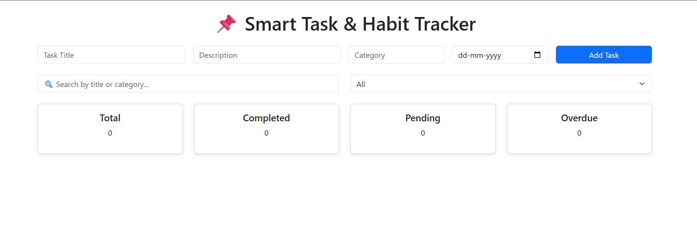
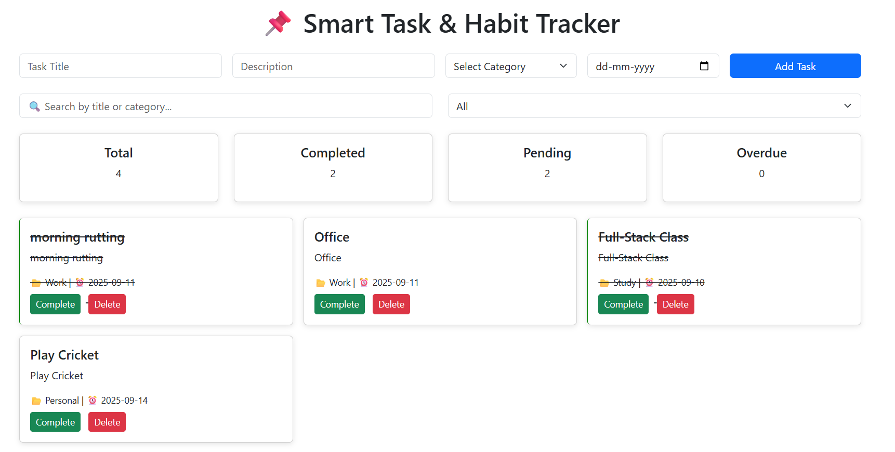
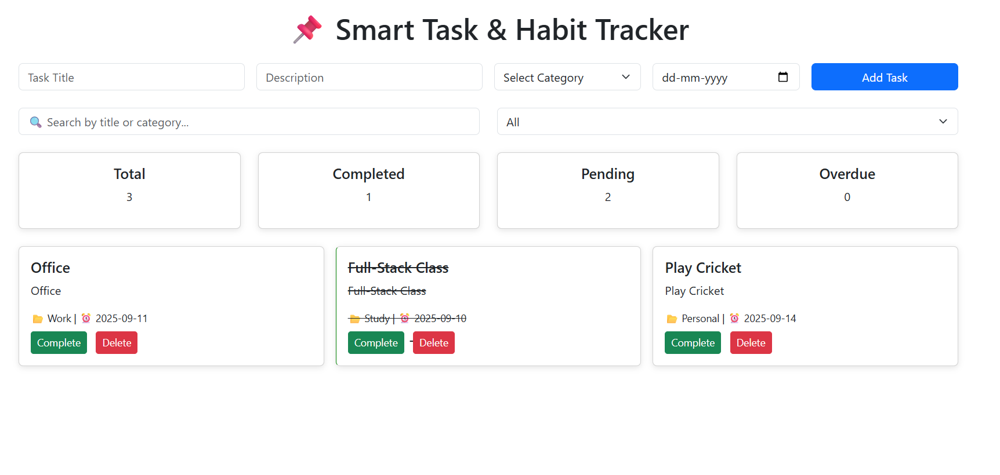
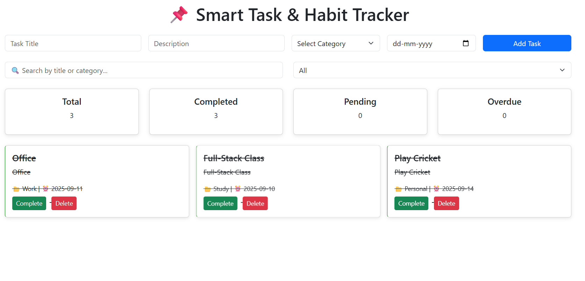
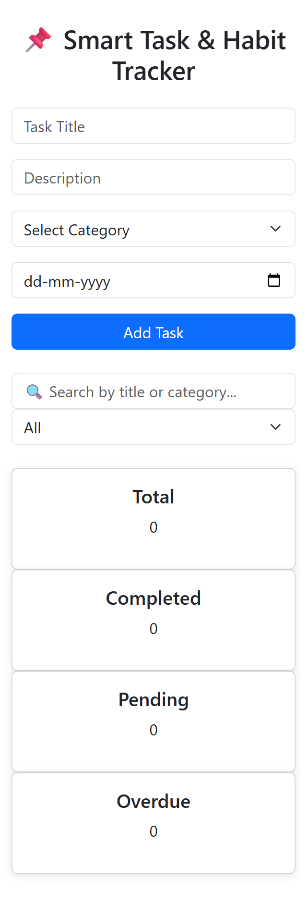

# 📌 Smart Task & Habit Tracker

## 📝 Project Definition
A JavaScript-based interactive dashboard that allows users to add, edit, delete, and mark tasks/habits as complete. All updates happen in real-time using DOM manipulation. Data is stored only in memory (arrays/objects). No backend or persistent storage is used.

## 🚀 Features
- Add tasks with title, description, category, due date
- Mark tasks as complete or delete them
- Real-time dashboard with task summary
- Search and filter tasks instantly
- OOP-based task management (Class & Inheritance)

## 📊 Dashboard
- Total Tasks
- Completed Tasks
- Pending Tasks
- Overdue Tasks

## 🖼 Screenshots

## 📚 Concepts Covered
- DOM Manipulation
- Arrays & Objects
- Loops & Functions
- Classes & OOP
- ES6 Features
- Conditional Statements
- Bootstrap + Responsive Design

## ⚡ Notes
- Data clears on page refresh (in-memory only)
- No backend or localStorage used
